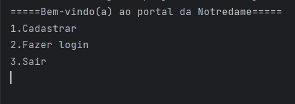
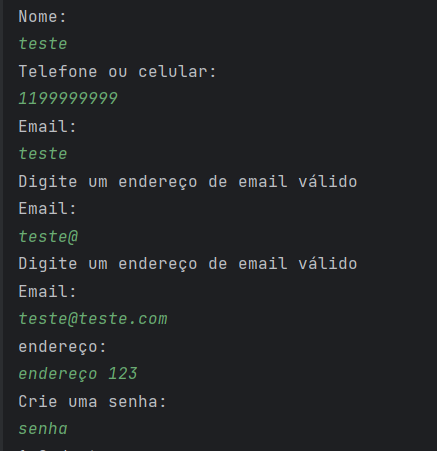
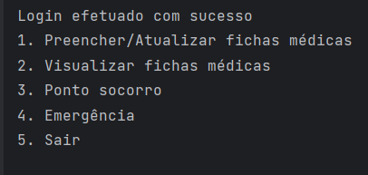
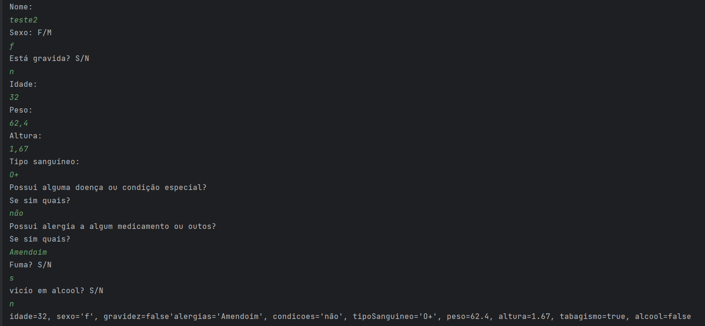
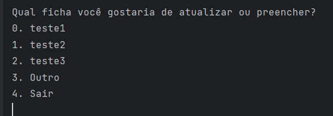
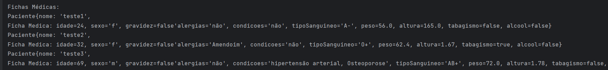
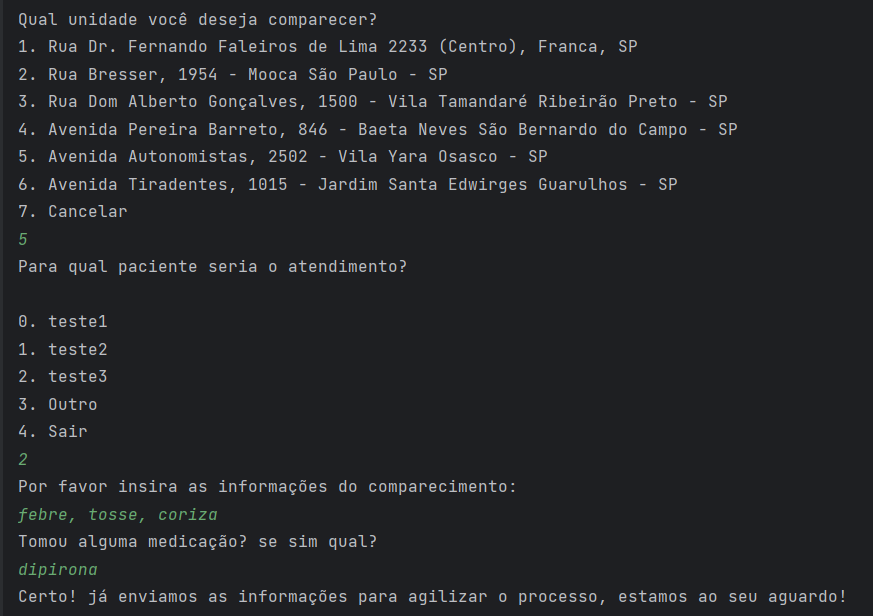
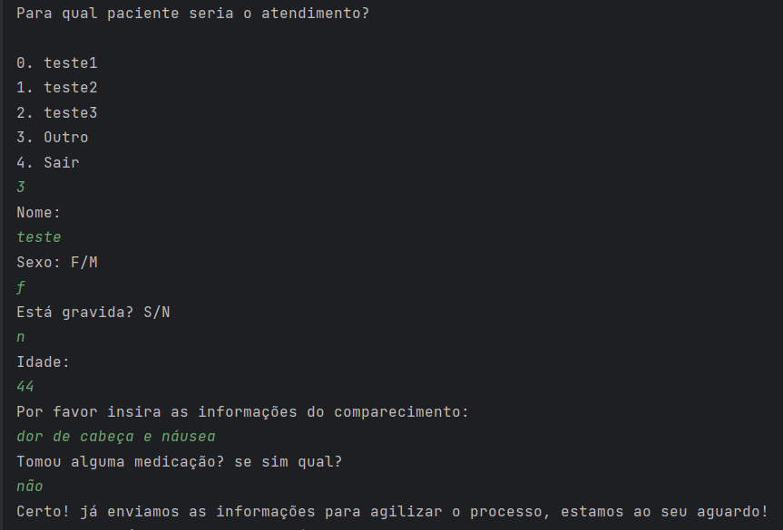
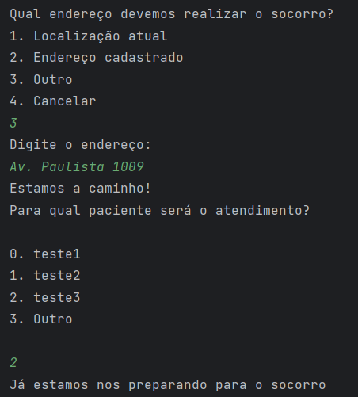

<h1 align="center"> Global Solution Java</h1>
<h2 align="center">Projeto com recursos para a melhoria da saúde voltado para idosos e cuidadores👩‍⚕️</h2>
<h4 align="center">
	🚧   Concluído 🚀 🚧
</h4>
<p align="center">
 <a href="#objetivo">Objetivo</a> •
 <a href="#funcionalidades">Funcionalidades</a> • 
 <a href="#executar">Como executar</a>• 
 <a href="#desenvolvedores">Desenvolvedores</a>
</p>
<h2 id="objetivo">💻 Sobre o projeto</h2>
O projeto foi desenvolvido com o propósito de criar um menu com um sistema de pré triagem, botão de emergência e adiministração das fichas médicas do grupo familiar. </br>
Este projeto faz parte da Global Solution , fornecida pela instituição FIAP.
 <h2 id="funcionalidades">⚙️ Funcionalidades</h2>

 - **Menu principal**
 - [x] Criar um cadastro
 - [x] Fazer Login
 - **Menu do login**
- [x] Preencher/Atualizar fichas médicas
- [x] Visualizar fichas médicas cadastradas
- [x] Ponto socorro/Pré triagem
- [x] Botão de emergência

<h2 id="executar">⚒️Como executar e usar o progrma</h2>
<h3>pré-requisitos</h3>
Antes de começar, você precisa ter instalado em sua máquina o GIT. Além disso você também precisa ter instalado algum programa que execute códigos em Java, como o Intellig, Eclipse, NetBeans, entre outros.
<h3>Como executar</h3>
<p>1. Clone o projeto em sua máquina utilizando o comando `git clone` no terminal.<br/>
2. Abra a pasta do projeto no seu ambiente de desenvolvimento.<br/>
3. Execute a classe `Main` para iniciar o programa.<br/>
Após isso aparecerá o menu com as seguintes opções:</p>

<p>Ao realizar um cadastro o programa pedirá as seguintes informações: </p>

<p>Note que para um email ser válido ele precisa ter "@" e ".com" em seu endereço</br>Para isso fizemos a seguinte validação que causa uma exceção, caso o email inserido não seja válido:</p>

```java
        try {
                System.out.println("Email: ");
                var email = scanner.nextLine();
                var achou = 0;
                if (email.contains("@") && email.contains(".com")) {


                    if (!logins.isEmpty()) {
                        for (Login l : logins) {
                            //Confere se o email já foi cadastrado
                            if (l.getEmail().equals(email)) {
                                System.out.println("Este email já foi cadastrado");
                                achou = 1;
                                break;
                            }
                        }
                    }
                    if (achou == 0) {
                        novoLogin.setEmail(email);
                        break;
                    }
                } else {
                    throw new RuntimeException();
                }        
  ```

  <p>Também criamos o seguinte método para validar o cadastro na hora de realizar o login:</p>

```java
     public static boolean verificarLogin(ArrayList<Login> logins, String username, String senha) {
        for (Login l : logins) {

            //Verifica se o username inserido é igual ao email cadastrado
            if (l.getEmail().equals(username)) {
                //Verifica se a senha inserida corresponde a senha cadastrada
                if (l.getSenha().equals(senha)) {
                    return true;

                }
            }

        }
        return false;
    }

```

<p>Após realizar o Login o usuário terá as seguinte opções:</p>

<p>Na primeira opção o usuário pode atualizar as fichas médicas dos pacientes cadastrados ou preencher uma nova ficha para um novo paciente.</br>
Clicando a primeira vez, o programa irá realizar automaticante o cadastro da primeira ficha pedindo as seguinte informações:</p>

<p>O programa só irá pedir a informação de gravidez se o paciente for do sexo feminino.</br>Após cadastrar a primeira ficha médica, ao clicar na primeira opção do menu você terá a opção de atualizar a ficha médica de algum paciente existente ou criar uma ficha para um novo paciente, selecionando a opção "outro". </p>

<p>Na opção 2 do menu podemos visualizar as ficha médicas cadastradas</p>

<p>Na opção 3 do menu podemos efetuar uma pré triagem para agilizar o atendimento no ponto socorro.</br> Primeiro selecionamos a unidade de comparecimento e depois o paciente que irá comparecer. Após isso o programa pede as informações para a ficha de triagem</p>

<p>Caso o paciente ainda não esteja cadastrado, o usuário pode selecionar o opção "outro", e o programa irá pedir informações adicionais para realizar a triagem</p>

<p>A opção 4 do menu é para emergências, onde o usuário precisa chamar uma ambulâcia.</br>Nesta opção o programa pede o endereço para o resgate e o usuário informa qual paciente precisa do socorro. Com isso, o hospital pode realizar um preparo antecipado.</p>

<p>Por fim, podemos encerrar o programa digitando a opção 5 para retornar ao menu principal e depois a opção 3 para sair.</p>
<h2 id="desenvolvedores">👩‍💻Desenvolvedores</h2>

<table>
  <tr>
    <td align="center"><br /><sub><b>Celeste Mayumi</b></sub><br /><a href="https://www.linkedin.com/in/celestetanaka/" title= "Linkedin"></a><a href="https://github.com/celestemayumi" title="GitHub"></a></td>  
    <td align="center"><br /><sub><b>Lívia Lopes</b></sub><br /><a href="https://www.linkedin.com/in/liviamarianalopes/" title="Linkedin"></a><a href="https://github.com/LiviaMarianaLopes" title="GitHub"></a></td>
    <td align="center"><br /><sub><b>Luana Vieira</b></sub><br /><a href="https://www.linkedin.com/in/luana-vieira-a093b5289/" title="Linkedin"></a><a href="https://github.com/luacttau" title="GitHub"></a></td>
   
  </tr>
</table>


